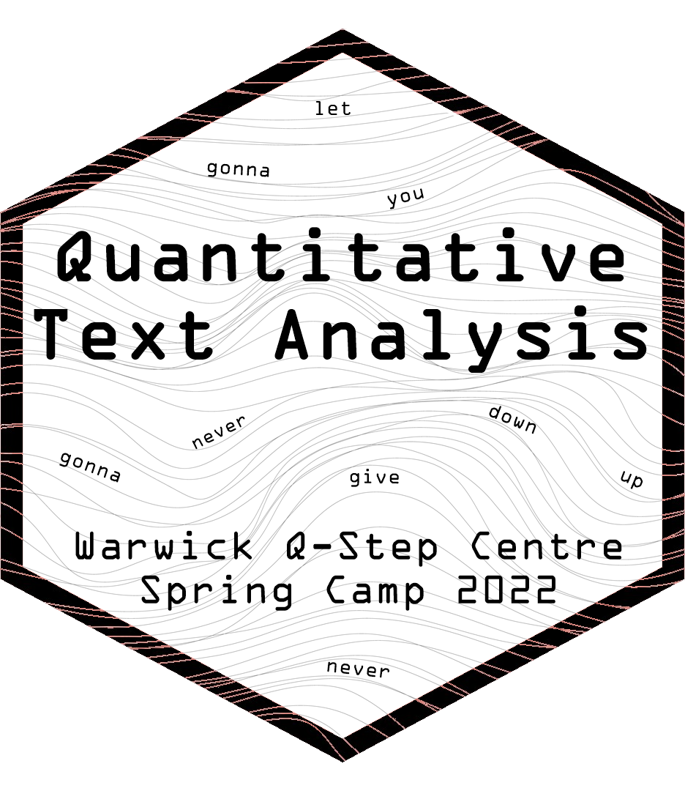

# Quantitative Text Analysis in R 

```{r, include = FALSE}
knitr::opts_chunk$set(
  collapse = TRUE,
  comment = "#>"
)
```


<!-- badges: start -->
[](https://app.netlify.com/sites/coursedown/deploys)
<!-- badges: end -->

## A gentle hands-on introduction

We live in a digital society, and enormous amounts of textual data are generated every day. Text analysis for social science research is not new, but with recent computational advances, we can now process text much more efficiently and in greater quantity. 

Quantitative text analysis is a set of tools that help make sense of textual data by systematically extracting information from texts. This workshop will teach you the fundamentals of quantitative text analysis and provide you with hands-on experience with cutting-edge methods implemented in R. 

The workshop covers important basics (e.g., pre-processing, tokenization, and part-of-speech tagging) as well as three types of analytic techniques: rule-based, unsupervised, and supervised methods (dictionary methods, topic models and machine learning, respectively). 

By the end of this workshop, participants will have a good understanding of the potentials and limitations of quantitative text analysis, as well as some experience working with the R software packages for conducting this type of analysis.


+ Day I

    + [Slides](https://favstats.github.io/WarwickSpringCamp_QTA/slides/day1/#1)
    + [Google Colab](https://colab.research.google.com/drive/1cwaDldUvXMrtT1DT93UhhcdOBqATKM-E?usp=sharing)
    
You may prefer to use R in Rstudio, there is also an Rmarkdown version of the code [here](https://github.com/favstats/WarwickSpringCamp_QTA/blob/main/Rmd/QTA_Day1.Rmd).

+ Day II

    + will be posted soon :)
