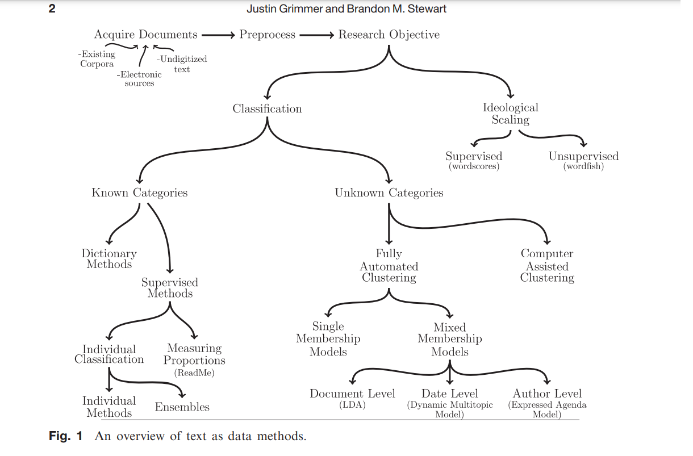
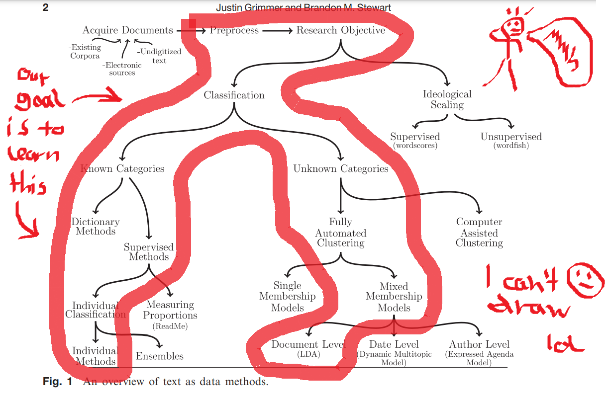
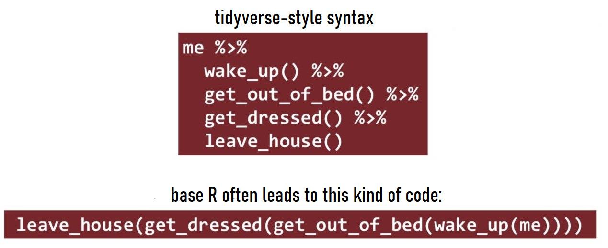
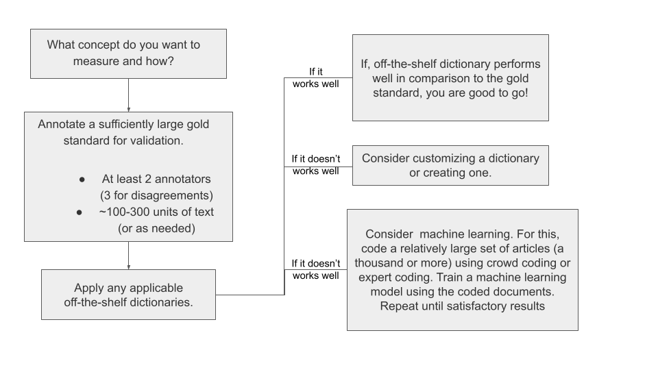

layout: true

<style>
.onehundredtwenty {
  font-size: 120%;
   }

<style>
.ninety {
  font-size: 90%;
   }

.eightyfive {
  font-size: 85%;
   }
   
.eighty {
  font-size: 80%;
   }
   
.seventyfive {
  font-size: 75%;
   }
   
.seventy {
  font-size: 70%;
   }
   
.fifty {
  font-size: 50%;
   }
   
.forty {
  font-size: 40%;
   }
</style>


```{r meta, echo=FALSE, warning=F, message=F}


library(metathis)
meta() %>%
  meta_general(
    description = "Quantitative Text Analysis in R",
    generator = "xaringan and remark.js"
  ) %>%
  meta_name("github-repo" = "favstats/xxx") %>%
  meta_social(
    title = "Quantitative Text Analysis in R",
    url = "https://www.favstats.eu",
    og_type = "website",
    og_author = "Fabio Votta",
    twitter_card_type = "summary_large_image",
    twitter_creator = "@favstats"
  )
```


```{r setup, include=FALSE}
# dateWritten <- format(as.Date('2020-05-04'), format="%B %d %Y")
workshop_day <- format(as.Date("2022-06-28"), format="%B %d %Y")
pacman::p_load(tidyverse, fontawesome, tidyverse, knitr, xaringanthemer)

options(
    htmltools.dir.version = FALSE,
    knitr.table.format = "html",
    knitr.kable.NA = ""
)
knitr::opts_chunk$set(
    warning = FALSE,
    message = FALSE,
    fig.path = "figs/",
    fig.width = 7.252,
    fig.height = 4,
    comment = "#>",
    fig.retina = 3 # Better figure resolution
)


# Enables the ability to show all slides in a tile overview by pressing "o"
xaringanExtra::use_tile_view()
xaringanExtra::use_panelset()
xaringanExtra::use_clipboard()
# xaringanExtra::use_share_again()
# xaringanExtra::style_share_again(share_buttons = "all")
xaringanExtra::use_extra_styles(
  hover_code_line = TRUE,
  mute_unhighlighted_code = FALSE
)
# xaringanExtra::use_webcam()


knitr::opts_chunk$set(warning = F, message = F) # Whether to display errors
```


---
name: title-slide
class: title-slide, center, middle


<div class="my-logo-right"></div> 

<br>

# .font150[.fancy[`r rmarkdown::metadata$title`]] 

### .font120[.fancy[`r rmarkdown::metadata$subtitle`]]

*Warwick Q-Step Centre Spring Camp 2022*

Instructor: Fabio Votta

[`r fa(name = "twitter", fill = "white")` @favstats](http://twitter.com/favstats)<br>
[`r fa(name = "github", fill = "white")` @favstats](http://github.com/favstats)<br>
[`r fa(name = "globe", fill = "white")` favstats.eu](https://www.favstats.eu)


28th June 2022 (Day 1)

.fifty[Link to slides: [favstats.github.io/WarwickSpringCamp_QTA/slides/day2/](https://favstats.github.io/WarwickSpringCamp_QTA/slides/day1/)]


---

### Your friendly neighborhood R Instructor

.leftcol40[


]

.rightcol60[
+ Ph.D. Candidate in Political Communication at University of Amsterdam

+ Passionate about R and Data Science

+ I love to travel (when there is no pandemic)

+ I enjoy and (occasionally) create R memes

<center>


.font60[
[twitter.com/rstatsmemes](https://twitter.com/rstatsmemes)

</center>

]


]

---

### It's not unusual to struggle at first but it gets better!

```{r, echo = F, out.width="80%", fig.align = 'center'}
knitr::include_graphics("https://raw.githubusercontent.com/favstats/ds3_r_intro/main/images/r_first_then_new.png")
```


<!-- {width=50%} -->

.fifty[Illustration adapted from [Allison Horst](https://twitter.com/allison_horst)]

--

  + My experience is that this stuff isn't super easy... but it gets better!
  
--
  
+ Awesome inclusive community that is always ready to help
+ Active blogosphere with use cases and examples

---


class: center, middle, inverse

# .fancy[.red[Quantitative]] Text Analysis

  
---

class: center, middle, inverse

# .fancy[.red[Quantitative]] Text Analysis

<center>


  
</center>
  
---


## .fancy[.red[Quantitative]] Text Analysis

.pull-left[
.font90[First, a note on *terms*:]

.font90[.red[Quantitative Text Analysis]] 

.font90[.blue[Computational Text Analysis]] 

.font90[.purple[Natural Language Processing (NLP)]] 

.font90[.orange[Text as Data] .green[Text Mining]]

.font90[**Here**, I will be using them interchangeably] 

.font50[(even though some peope might be mad at me for that)]

]

--

.pull-right[


]


---


## .fancy[.red[Quantitative]] vs. .fancy[.blue[Qualitative]] (?)

.pull-left[

.font80[
**Quantitative text analysis**

   + looks at **features of a text**
   
   + computers don't inherently understand what words or sentences are
   
   + transformation into metrics (word frequencies, co-occurrences etc.)
   
   + Goal: find/describe patterns and trends in text
   
   + "distant reading"
]


]


--

.pull-right[

.font80[

**Qualitative text analysis**

  + looks at the **meaning of a text** 
  
  + understand the author's point of view and its context
  
  + narrativize experiences of author/people mentioned in the text
  
  + Goal: interpret and understand viewpoints and concepts in text
  
  + "close reading"
  
]


  
]
   
   
--
  
<br>
  
In practice, these approaches will often overlap!

---


## .fancy[.red[Quantitative]] Text Analysis

**I N T E R D I S C I P L I N A R I T Y**

+ social sciences
+ digital humanities
+ data science
+ linguistics
+ media studies
+ computer science
+ ...

.font50[(at least in theory but too many times the institutional boundaries are too thick)]

---


## .fancy[.red[Quantitative]] Text Analysis

Four Principles of Automated Text Analysis (Grimmer & Stewart 2013)

> (1) All quantitative models of language are wrong—but some are useful.

> (2) Quantitative methods for text amplify resources and augment humans.
 
> (3) There is no globally best method for automated text analysis.

> (4) Validate, Validate, Validate


---




---




---

### Overview Day 1 (13:00 - 16:00)


+ Introduction .font40[(*You* are here)]

+ Manipulating strings in R 

+ Tokenization
  + Pre-processing (e.g. stop words removal)

15   M I N U T E S   B R E A K:   *14:30*

+ term frequency–inverse document frequency (tf-idf)

+ Rule-based methods (i.e. dictionaries)

+ Some exercises

---


### Overview Day 2 (9:30 to 16:00)

+ Part-of-speech tagging
  + Keyword extraction
  + RAKE, Noun phrases, dependency parisng
  
15   M I N U T E S   B R E A K:   *10:45*

+ Unsupervised Machine Learning (Topic Modelling)
  
1   H O U R   B R E A K:   *12:00*

+ Supervised Machine Learning

15   M I N U T E S   B R E A K:   *14:30*

+ Project (45 minutes time)

*30 minutes for presentations and Q & A*


---

class: center, middle, inverse


---

## What is the `tidyverse`?


.font80[

.pull-left[


The tidyverse describes itself:

> The tidyverse is an opinionated **collection of R packages** designed for data science. All packages share an underlying design philosophy, grammar, and data structures.

```{r}
# install.packages("tidyverse")
library(tidyverse)
```
]


.pull-right[

All you need to learn about the tidyverse:


Free book: [R for Data Science](https://r4ds.had.co.nz/)


]


]


---

## `tidyverse ` style syntax

.font80[

Using the pipe operator `%>%` we can read code from left-to-right and from top-to-bottom.

This is opposed to base R functions that may have deeply nested function calls.

]

--




.font30[
Source: https://twitter.com/andrewheiss/status/1173743447171354624 (Andrew Heiss)
]


---


## `tidyverse ` style syntax

.font80[

Using the pipe operator `%>%` we can read code from left-to-right and from top-to-bottom.

This is opposed to base R functions that may have deeply nested function calls.

]


---

## `tidyverse ` style syntax

Read from top to bottom and from left to right and the `%>%` as *"and then"*.

```{r}
palmerpenguins::penguins %>% 
  select(species, island, body_mass_g) %>% 
  filter(island == "Dream") %>% 
  mutate(bodymass_kg = body_mass_g/1000) %>% 
  rename(which_type_of_pingu = species)
```

---


### `tidyverse ` functions reference list


.pull-left[


.font80[

For reference, here is a list of some useful  `tidyverse` functions.

If you have trouble with any of these functions, try reading the documentation with `?function_name` or ask me :)

]

.font40[

* `filter()`

  * Subset rows using column values

* `mutate()`

  * Create and modify delete columns

* `rename()`

  * Rename columns

* `select()`

  * Subset columns using their names and types

* `summarise()`; `summarize()`

  * Summarise each group to fewer rows

* `group_by()`; `ungroup()`

  * Group by one or more variables

* `arrange()`

  * Arrange rows by column values

]
]


.pull-right[


.font80[

> Remember: tidyverse-style functions take the **data** as first argument.

<br>

]


.font40[

* `count()`; `tally()` 

  * Count observations by group

* `distinct()`

  * Subset distinct/unique rows

* `pull()`

  * Extract a single column

* `case_when()`

  * useful for recoding (when `ifelse` is not enough)

* `separate()`

  * separate two variables by some separator

* `pivot_wider()`

  * turn data into wide format

* `pivot_longer()`

  * turn data into long format

]


]


---

## Google Colab


For the purposes of this workshop we are going to use **Google Colab**.

Google Colab provides an online environment for teaching.

.blue[Upsides] 

+ No need to set up R and RStudio on your own computer

.red[Downsides]

+ You will have to set up R and RStudio on your own computer (when you want to use R on your own)


Link to the first Google Colab  (out of two): [tinyurl.com/wqtaday1](https://colab.research.google.com/drive/1cwaDldUvXMrtT1DT93UhhcdOBqATKM-E?usp=sharing)


---

class: center, middle, inverse

## Working with text in R


---

# *Strings* in R

--

.font80[

```{r}
"Hello I am a string! In R I am known by the class of 'character'"
```
]


--

.font80[

You can also have multiple texts in one vector by concatenating with `c()`

```{r}
c("Hello I am a string!",  "In R I am known by the class of 'character'")
```
]

--


.font80[

And of course we may also assign this vector to an object using `<-`

```{r}
chr_vector <- c("Hello I am a string!",  "In R I am known by the class of 'character'")
chr_vector
```
]

---

## *Strings* in data frames

```{r}
palmerpenguins::penguins_raw  %>% 
  arrange(desc(`Culmen Length (mm)`)) %>% head() %>% 
  select(2:5) %>% knitr::kable()
```


---


class: center, middle

## Working with text in R

### String theory with the help of 

### `stringr`

```{r}
library(stringr)
```


---

.leftcol75[

### Manipulating Strings

.font80[
- `stringr` package is for manipulating strings. 
]

]

.rightcol25[


```{r, echo = F, out.width=100, out.height=120, fig.align='right'}
knitr::include_graphics("https://stringr.tidyverse.org/logo.png")
```

]

.font80[

- It has functions for 

  + **Detecting patterns in strings:** `str_detect()`
  
  + **replacing/removing parts:** `str_replace()` or `str_remove()`
  
  + **trimming whitespace:** `str_trim()` or `str_squish()`
  

]
  
--

| functions    | what it does                             |
|--------------|------------------------------------------|
| `str_count` | count how often a pattern occurs             |
| `str_extract`  | extract a pattern from a string           |
| `str_length`   | count how many characters does a string have        |
| `str_starts`, `str_ends` | tests if string starts/ends with certain pattern         |
| `str_to_lower`, `str_to_upper` | to lower/upper case |


---
  
### **Detecting**, extracting, replacing and removing patterns


Detect a pattern:

```{r}
str_detect(string = "Hello I am a string", pattern = "I am part of the string!")

```

--

```{r}
str_detect(string = "Hello I am a string", pattern = "Hello")

```
  
--

```{r}
str_detect(string = "Hello I am a string", pattern = "hello")

```
  


---

### **Detecting**, extracting, replacing and removing patterns

Filter a dataset: **WITHOUT** `stringr`
  
```{r}

palmerpenguins::penguins_raw %>% 
  filter(Species == "Gentoo penguin (Pygoscelis papua)")


```
  
---
  
  
### **Detecting**, extracting, replacing and removing patterns
  
Filter a dataset: **WITH** `stringr`

  
```{r}

palmerpenguins::penguins_raw %>% 
  filter(str_detect(Species, "Gentoo"))


```


---
  
  
### Detecting, **extracting**, replacing and removing patterns
  
  
  
```{r}
str_extract(string = "Hello I am a string", pattern = "a")
```
```{r}
str_extract_all(string = "Hello I am a string", pattern = "a")
```
  
  
---
  
### Detecting, extracting, **replacing** and removing patterns
  
  
  
```{r}
str_replace(string = "Hello I am a string", pattern = "am", replacement = "REPLACED")
```


```{r}
str_replace_all(string = "Hello I am a string", pattern = " ", "---")
```
  
  
  
---
  
  
### Detecting, extracting, replacing and **removing** patterns
  
  
  
```{r}
str_remove(string = "Hello I am a string", pattern = "Hello ")
```


```{r}
str_remove_all(string = "Hello I am a string", pattern = " ")
```


---


### Detecting, extracting, replacing and **removing** patterns


```{r}
str_trim(string = "        Hello I am a string with lots of whitespace around      ")
```
  
  
```{r}
str_squish(string = "Hello    I am a     string with lots of whitespace inbetween")

```
  

---

class: center, middle

# .green[Reg]ular .blue[Ex]pression (.green[Reg].blue[ex])

.code60[`([_a-z0-9-]+(\\.[_a-z0-9-]+)\*@[a-z0-9-]+(\\.[a-z0-9-]+)\*(\\.[a-z]{2,4}))`]


---

## Regex

.code60[`([_a-z0-9-]+(\\.[_a-z0-9-]+)\*@[a-z0-9-]+(\\.[a-z0-9-]+)\*(\\.[a-z]{2,4}))`]

> A regular expression (regex) is a special sequence of characters that describes a search pattern. 

--

.font90[The regex above can be used to extract E-Mail addresses from text:]

```{r}
some_text <- c("Hi! This is my email: awesomemail@awesomewebsite.co.uk",
               "I have no E-mail but please have my number: +4918434342323")

str_extract(some_text, "([_a-z0-9-]+(\\.[_a-z0-9-]+)*@[a-z0-9-]+(\\.[a-z0-9-]+)*(\\.[a-z]{2,4}))")
```


---

## Regex

.font90[Here is a non-exhaustive list of special regex characters that work specifically in R ([more](https://stat.ethz.ch/R-manual/R-devel/library/base/html/regex.html)):]

| special R regex     | what it matches                                                                                             |
|-------------|-------------------------------------------------------------------------------------------------------------|
| `⁠[:lower:]⁠` | Lower-case letters in the current locale.                                                                   
| `⁠[:upper:]⁠` | Upper-case letters in the current locale.                                                                   |
| `⁠[:digit:]⁠` | Digits: `0 1 2 3 4 5 6 7 8 9⁠`.                                                                              |
| `⁠[:alpha:]⁠` | Alphabetic characters: `[:lower:]` and `⁠[:upper:]⁠`.                                                         |
| `⁠[:alnum:]⁠` | Alphanumeric characters: `⁠[:alpha:]` and `⁠[:digit:]⁠`.                                                       |
| `[:blank:]⁠` | Blank characters: space and tab, and possibly other locale-dependent characters such as non-breaking space. |
| `⁠[:punct:]⁠`| `⁠! " # $ % & ' () \* + , - . / : ; < = > ? @ [  ] ^ _ {  } ~⁠`                              |


---

## Regex

Remove punctuation:

```{r}
some_text <- "Here are some numbers: 232323."

str_remove_all(some_text, "[:punct:]")
```

Remove digits:

```{r}

str_remove_all(some_text, "[:digit:]")
```

Try some out yourself!⁠	

---


## Regex

Here are some more general regex special characters that typically work in most programming languages:

| symbols | what it matches                                                            |
|---------|----------------------------------------------------------------------------|
| `.⁠` |Placeholder character to match anything. |
| `⁠*`     | The preceding item will be matched **zero or more times**.                     |
| `⁠+⁠`     | The preceding item will be matched **one or more times**.                      |
| `{n}⁠`   | The preceding item is matched **exactly n times**.                             |
| `⁠{n,}⁠`  | The preceding item is matched **n or more times**.                             |
| `⁠{n,m}⁠` | The preceding item is matched **at least n times, but not more than m times**. |

---

## Regex


Consider the following sequence of strings that are variations of "Francis Fukuyama" but some of them are misspelled. We can come up with a regex that takes take care of all variations:

```{r}
some_text <- c("Francis Fukuyama", "francis fukuyama", "franis fukuyama", "franiss fukuyama")

str_extract(some_text, ".ranc*is{1,2} .ukuyama")
```

Some more resources to learn about regex:

1. https://stringr.tidyverse.org/articles/regular-expressions.html
2. https://spannbaueradam.shinyapps.io/r_regex_tester/

---

#### Small Regexercise(s)

.font70[Find the appropriate regex to extract each (mis)spelling of Nicolas Cage's name]


.panelset[
.panel[.panel-name[Strings]


```{r}
cage_text <- c("Nicolas Cage", "Nicolas Rage", "Nick Cage", "Nicolás Cagé", "Saint-Nicolas Cage")
```

]


.panel[.panel-name[Solution]

```{r}
str_extract(cage_text, ".{0,6}Nic.{1,4} .ag.")

```

]

]

---

#### Small Regexercise(s)

.font70[Find the appropriate regex to extract each (mis)spelling of Mark Wahlberg's name]


.panelset[
.panel[.panel-name[Strings]


```{r}
markimoo_text <- c("Mark Wahlberg", "Marc waalberg", "Mahrk Vahlbehrk", "Mark Wahlbergensis", "Mark the Man")

```

]


.panel[.panel-name[Solution]

```{r}
str_extract(markimoo_text, "Ma.*r. .a.lbe.*r.{1,6}|Mark the Man")

```

]
]

---

class: center, middle

#  Pre-processing

<center>


</center>

.font30[Source: https://cdn.dribbble.com/users/648258/screenshots/2502894/dribbble.gif]


---

## Pre-processing

.pull-left[

.font90[
Why pre-process?

1. Remove (replace) errors in the data
  + errors can happen when you scrape data
  + html tags (`<i>Hello<i/>`), encoding errors (`???☐☐☐`), etc.
2. Remove "uninteresting" text
  + misspellings?, URLs? words like "the", "and"?
  + *caution*: what is uninteresting?
  + depending on the context they might be very important!

]


]

.pull-right[

.font90[
> Pre-processing is whatever steps you (need to) take to clean up your data before you start your analysis.


]


]


---

## Pre-processing

.pull-left[

.font90[
Why pre-process?

1. Remove (replace) errors in the data
  + errors can happen when you scrape data
  + html tags (`<i>Hello<i/>`), encoding errors (`???☐☐☐`), etc.
2. Remove "uninteresting" text
  + misspellings?, URLs? words like "the", "and"?
  + *caution*: what is uninteresting?
  + depending on the context they might be very important!

]

]

.pull-right[

.font90[
> Pre-processing is whatever steps you (need to) take to clean up your data before you start your analysis.

> Always think what measures of pre-processing are appropriate for your data! 

Doe is it help understand the data? Introduce more bias?

]


]


---

## Pre-processing


.pull-left[

.font90[
Why pre-process?

1. Remove (replace) errors in the data
  + errors can happen when you scrape data
  + html tags (`<i>Hello<i/>`), encoding errors (`???☐☐☐`), etc.
2. Remove "uninteresting" text
  + misspellings?, URLs? words like "the", "and"?
  + *caution*: what is uninteresting?
  + depending on the context they might be very important!

]

]

.pull-right[

.font90[
> Pre-processing is whatever steps you (need to) take to clean up your data before you start your analysis.

> Always think what measures of pre-processing are appropriate for your data! 

> **EITHER WAY:** Always document your pre-processing approach so others can judge and reproduce the steps you take.

]


]

---

## Pre-processing

**Common methods of pre-processing**

1. Removing numbers
2. Removing punctuation
3. Removing whitespace
4. Text to lower case
5. Remove stop words
6. Stemming/Lemmatization

---


## Pre-processing

**Common methods of pre-processing**

1. Removing numbers `str_remove_all(text, "[:digit:]")`
2. Removing punctuation `str_remove_all(text, "[:punct:]")`
3. Removing whitespace `str_trim(text)` or `str_squish(text)`
4. Text to lower case `str_to_lower(text)`
5. Remove stop words
6. Stemming/Lemmatization

We learned how to do most of these already.

We are going to talk more about *removing stop words* and *stemming/lemmatization*. 

But first we need to introduce `tokenization`.

---

class: center, middle

# Tokenization

<center>


</center>

---


## Tokenization


> Tokenization is the process of breaking down a string of text into smaller elements called tokens. 

> Tokens can be individual words, phrases, or even complete sentences. 

Why tokenize?

Breaking text into smaller (meaningful) can help create metrics from patterns that the computer can understand

(more about that later)

---

## Tokenization


**Example of *white-space tokenization*:**

`I`  `am`  `a`   `sentence`

&#8595; T O K E N I Z E &#8595;

| `I` | `am` | `a` | `sentence` |


This will give us words (in most cases)


---


## Tokenization

**Example of *dot tokenization*:**

`I am a sentence.` `Here is the second one.`


&#8595; T O K E N I Z E &#8595;


| `I am a sentence` | `Here is the second one`


This will give us words (in many cases), but certainly not foolproof!

In reality, good tokenizers need to do more than just split a string by white-space or dots.

---

class: center, middle

## How can we tokenize in R?

We will do this shorty but first:

A short excourse in .fancy[tidy data] principles

---

## Short excourse: tidy data

.pull-left[


Definition of tidy data:

* Every column is a variable.
* Every row is an observation.
* Every cell is a single value.

]

.pull-right[

Here is an example of tidy data:

| animal | weight |  friendliness  |
| --- | --- | --- | 
| Domestic dog | 24.0 | 5.00 |
| Domestic cat | 12.0 | 3.08 |
| American alligator | 77.0 | 1.00 | 
| Golden hamster | 3.9 | 5.00 |
| King penguin | 26.0 |  3.71 |

]


---

## Untidy data

| Animal | weight/friendliness  |
| --- | --- | 
| Domestic dog | 24.0 / 5.00 |
| Domestic cat | 12.0 / 3.08 |
| American alligator | 77.0 / 1.00 | 
| Golden hamster | 3.9 / 5.00 |
| King penguin | 26.0 /  3.71 |

The data above has multiple variables per column.

= not tidy

---

## Core principle: tidy data

<center>

</center>

.fifty[Artist: [Allison Horst](https://github.com/allisonhorst)]
---

## Core principle: tidy data

Tidy data has two decisive advantages:

* Consistently prepared data is easier to read, process, load and save.

* Many procedures (or the associated functions) in R require this type of data.

<center>

</center>

.fifty[Artist: [Allison Horst](https://github.com/allisonhorst)]

---

## Tidy text data

.pull-left[

> "We thus define the tidy text format as being a table with **one-token-per-row**. *~Text Mining with R (Julia Silge and David Robinson)*

The **one-token-per-row** can be a single word, but can also an multiple words (n-gram), sentence, or paragraph.

]

.pull-right[

```{r, echo=F}
readRDS("../day2/data/pos_tags_trump_all.rds") %>%
  filter(doc_id == "1049690971934511104") %>% 
  select(token_id, token, upos) %>%
  slice(1:9) %>% knitr::kable()
```

]


---

.leftcol75[

## Text mining with `tidytext`

.font80[
The `tidytext` package provides various functions and support for manipulating text adhering to tidy data principles.
]

]

.rightcol25[


```{r, echo = F, out.width=100, out.height=120, fig.align='right'}
knitr::include_graphics("https://juliasilge.github.io/tidytext/reference/figures/logo.png")
```

]


  
.pull-left[

+ Pre-processing (stop words removal)

+ Tokenization

+ tf-idf (**t**erm **f**requency-**i**nverse **d**ocument **f**requency)

Free book hosted online: [tidytextmining.com](https://www.tidytextmining.com/)

]

.pull-right[


]

---


class: center, middle

## How can we tokenize in R?

.fancy[this time for realsies]

---

## Tokenization

To make these examples more fun we will use some Trump tweets to perform tokenization.

```{r}
## read in Trump tweets
trump_tweets <- readr::read_csv("https://raw.githubusercontent.com/favstats/WarwickSpringCamp_QTA/main/docs/slides/day1/data/trump_tweets.csv")
```

```{r}
## nuclear tweet
trump_tweet <- trump_tweets[trump_tweets$id == 1165918301932916736,]
```

```{r}
trump_tweet %>%
  pull(text)
```


---

### tokenizing with `unnest_tokens()`

`unnest_tokens` is the main workhorse of `tidytext` with it we can tokenize as words, sentences and more! 

It has three main arguments:

1. `output`: what should the new tokenized variable be called
2. `input`: what is the text variable that includes the text (already present in the dataset)
3. `token`: What are your tokens gonna be? Can be `"words" (default)`, `"characters"`, `"character_shingles"`, `"ngrams"`, `"skip_ngrams"`, `"sentences"`, `"lines"`, `"paragraphs"`, `"regex"`, `"tweets"` (tokenization by word that preserves usernames, hashtags, and URLS)

`unnest_tokens(text_data, output = word, input = text, token = "words")`

---

### tokenizing with `unnest_tokens()`

```{r}
library(tidytext)

trump_tweet %>%
  unnest_tokens(output = word, input = text, token = "words") %>%
  pull(word)
```

---


### tokenizing with `unnest_tokens()`

Keep uppercase letters and punctuation:

```{r}
trump_tweet %>%
  unnest_tokens(output = word, input = text, token = "words", 
                to_lower = FALSE, strip_punct = FALSE) %>%
  pull(word)
```

---


### tokenizing with `unnest_tokens()`

We can also easily create sentences as tokens:

```{r}

trump_tweet %>%
  unnest_tokens(output = word, input = text, token = "sentences") %>%
  pull(word)
```

---


### tokenizing with `unnest_tokens()`

We can also create so-called **ngrams**, words that follow each other:

**bigrams**: two words that follow each other

```{r}
trump_tweet %>%
  unnest_tokens(output = bigrams, input = text, token = "ngrams", n = 2) %>%
  pull(bigrams)
```

---


### tokenizing with `unnest_tokens()`


**trigrams**: three words that follow each other

```{r}
trump_tweet %>%
  unnest_tokens(output = trigrams, input = text, token = "ngrams", n = 3) %>%
  pull(trigrams)
```

---

class: center, middle

## Word Frequencies

Let's count the words most often used by the former US President:

<center>


</center>


---

### Word Frequencies


.font80[First, we tokenize all tweets into words:]

.code60[
```{r}
trump_words <- trump_tweets %>%
  unnest_tokens(word, text, token = "words")
```
]


.font80[Then, we simply count the number of words:]


.code60[
```{r}
trump_words %>% 
  count(word, sort = T) %>%
  slice(1:20) %>% 
  mutate(word_n = paste0(word, ": ", n)) %>% 
  pull(word_n)
```
]


---

## Pre-processing: stop words

```{r, echo = F}
trump_words %>% 
  count(word, sort = T) %>%
  slice(1:20) %>% 
  mutate(word_n = paste0(word, ": ", n)) %>% 
  pull(word_n)
```


Ok. So there are a lot of words that are not that informative on their own like: `the`, `a`, `you`, etc. These words are commonly referred to as **stop words**.

> stop words are words that are commonly used in a language but may have little meaning on their own. For bag-of-words approaches (i.e. looking at individual words without context) they are often removed from text in pre-processing because they can may hide more meaningful words. 


---

### Pre-processing: stop words

.font85[
> **However**, removing stop words is a very crude method and you should inspect the list of stop words *carefully* for your use-case before you remove anything.
]

.font85[`tidytext` comes with several lexicons of stop words, some of them have more or less words defined as stop words:]


.panelset[
.panel[.panel-name[Show lexicons]


```{r}
stop_words %>% count(lexicon)
```
]


.panel[.panel-name[Some stop words]
```{r}
sample(stop_words$word, 10)
```
]

]

---

### Pre-processing: stop words


.font80[For the sake of simplicity, let's just remove stop words from all provided lexicons to see if we can find some patterns in what Trump was talking about. *Note: this would normally not be advised without thoroughly checking the stop words yourself.*]

.panelset[
.panel[.panel-name[R Code]

```{r, eval = F}
trump_words %>%
  anti_join(stop_words) %>%
  count(word, sort = T)  %>%
  slice(1:20) %>% 
  mutate(word_n = paste0(word, ": ", n)) %>% 
  pull(word_n)
```
]

.panel[.panel-name[Output]

```{r, echo = F}
trump_words %>%
  anti_join(stop_words) %>%
  count(word, sort = T)  %>%
  slice(1:20) %>% 
  mutate(word_n = paste0(word, ": ", n)) %>% 
  pull(word_n)
```
]
]


---

### Pre-processing: stop words


Looks like there are still a bunch of words (mostly Twitter artifacts like url fragments, user names) that are not so meaningful. 

We can add more stop words to the existing list of stop words like this:

.panelset[
.panel[.panel-name[Create new stop words and add to old one]

```{r}
additional_stop_words <- data.frame(word = c("t.co", "https", "realdonaldtrump", "rt", "amp", "http"))

enhanced_stop_words <- stop_words %>%
  bind_rows(additional_stop_words)
```


]

.panel[.panel-name[Remove new stop words and count]

```{r, eval = F}
trump_words %>%
  anti_join(enhanced_stop_words) %>%
  count(word, sort = T)  %>%
  slice(1:20) %>% 
  mutate(word_n = paste0(word, ": ", n)) %>% 
  pull(word_n)
```
]

.panel[.panel-name[Output]

```{r, echo = F}
trump_words %>%
  anti_join(enhanced_stop_words) %>%
  count(word, sort = T)  %>%
  slice(1:20)  %>% 
  mutate(word_n = paste0(word, ": ", n)) %>% 
  pull(word_n)
```
]
]

---

## What are the top words used by Trump by year?

.panelset[
.panel[.panel-name[Count top words per year]
```{r}
top10_words_per_year <- trump_words  %>%
  anti_join(enhanced_stop_words) %>%
  count(date_year, word, sort = T) %>%
  arrange(-n) %>%
  filter(date_year %in% 2016:2021)  %>%
  group_by(date_year) %>%
  slice(1:10) %>%
  ungroup()
```
]
.panel[.panel-name[R code for visualization]
```{r, eval = F}
library(ggplot2)

top10_words_per_year %>% 
  mutate(word = reorder_within(word, n, date_year)) %>%
  ggplot(aes(word, n, fill = date_year)) +
  geom_col(show.legend = FALSE) +
  facet_wrap(~date_year, scales = "free") +
  scale_x_reordered() +
  coord_flip()
```
]

.panel[.panel-name[Visualization]
```{r, echo = F, fig.width=13, fig.height=6}
library(ggplot2)

top10_words_per_year %>% 
  mutate(word = reorder_within(word, n, date_year)) %>%
  ggplot(aes(word, n, fill = date_year)) +
  geom_col(show.legend = FALSE) +
  facet_wrap(~date_year, scales = "free") +
  scale_x_reordered() +
  coord_flip()
```
]
]


---


class: center, middle, inverse

# tf-idf

<center>


</center>

---

## Some terminology


+ **Document**

  + In quantitative text analysis, when we talk about documents, we mean some broader unit of text, for example a speech, or a chapter in a book.

+ **Corpus**

  + A collection of documents

.rightcol30[

]


  
---

## Small exercise

We have three documents. Each includes a statement:

| Document 1                                  | Document 2                                         | Document 3                                                      |
|---------------------------------------------|----------------------------------------------------|-----------------------------------------------------------------|
| My cat is too much good. The world is a great place.  | The planet is a terrible place. The world comes with too much suffering. | The place is terrible, with a bad WiFi connection, too. |

Imagine you are explaining to someone what each document is about using the words from that document. 

1. Which words are the least informative and why?

2. Which words are the most informative and why?

---


## Small exercise

We have three documents. Each includes a statement:

| Document 1                                  | Document 2                                         | Document 3                                                      |
|---------------------------------------------|----------------------------------------------------|-----------------------------------------------------------------|
| My cat **.red[is]** **.red[too]** much good. **.red[The]** world is **.red[a]** great **.red[place]**.  | **.red[The]** planet **.red[is]** **.red[a]** terrible **.red[place]**. **.red[The]** world comes with **.red[too]** much suffering. | **.red[The]** **.red[place]** **.red[is]** terrible, with **.red[a]** bad WiFi connection, **.red[too]**. |


> Answer 1: The words that are least informative about the documents are the ones that occur in all three: `place`, `"the"`, `"is"`, `"too"`, `a`.


---

## Small exercise

We have three documents. Each includes a statement:

| Document 1                                  | Document 2                                         | Document 3                                                      |
|---------------------------------------------|----------------------------------------------------|-----------------------------------------------------------------|
| **.blue[My]** **.blue[cat]** is too much **.blue[good]**. The world is a **.blue[great]** place.  | The **.blue[planet]** is a terrible place. The world comes with too much **.blue[suffering]**. | The place is terrible, comes with a **.blue[bad WiFi connection]**, too. |


> Answer 2: The words that are most informative about the documents are the ones that uniquely (or more often) appear in one document over the others. Document 1: `my`, `cat`, `good`, `great`. Document 2: `planet`. `suffering`. Document 3: `bad`, `wifi`, `connection`.

---

## Quantifying *informativeness* with tf-idf

What is tf-idf?

> Tf-idf is a technique used for ranking terms based on the frequency of a given term in a range of documents. Tf-idf stands for **t**erm **f**requency-**i**nverse **d**ocument **f**requency. 

.font85[

TF(t) = (Number of times term t appears in a document) / (Total number of terms in the document).

IDF(t) = log(Total number of documents / Number of documents with term t in it).

]


.font70[
The term frequency (tf) is the number of times a given term appears in a document. The inverse document frequency (idf) is the number of documents that contain the given term divided by the total number of documents. The tf-idf score is the product of the term frequency and inverse document frequency.
]


---

## Quantifying *informativeness* with tf-idf

.font80[
| Document 1                                  | Document 2                                         | Document 3                                                      |
|---------------------------------------------|----------------------------------------------------|-----------------------------------------------------------------|
| My cat **is** too much good. The world **is** a great place.  | The planet **is** a terrible place. The world comes with too much suffering. | The place **is** terrible, with a bad WiFi connection, too. |
]


.panelset[
.panel[.panel-name[Calculate tf]

.font70[TF(`is`) = (Number of times term **is** appears in a document) / (Total number of terms in the document).]

```{r}
freq_is <- c(doc1 = 2, doc2 = 1, doc3 = 1)
n_terms <- c(doc1 = 12, doc2 = 13, doc3 = 11)

tf <- freq_is/n_terms

tf
```

]


.panel[.panel-name[Calculate idf]

.font70[IDF(`is`) = log(Total number of documents / Number of documents with term **is** in it).]

```{r}
n_doc <- 3
n_doc_is <- 3

idf <- log(n_doc / n_doc_is)

idf
```

]


.panel[.panel-name[Calculate tf-idf]

```{r}
tf_idf <- tf*idf
tf_idf
```

> It's 0, which means this term is very uninformative for any of the documents! 

]

]


---

## Quantifying *informativeness* with tf-idf

.font80[
| Document 1                                  | Document 2                                         | Document 3                                                      |
|---------------------------------------------|----------------------------------------------------|-----------------------------------------------------------------|
| My cat is too much good. The world is a great place.  | The planet is a **terrible** place. The world comes with too much suffering. | The place is **terrible**, with a bad WiFi connection, too. |
]


.panelset[
.panel[.panel-name[Calculate tf]

.font70[TF(`terrible`) = (Number of times **terrible** appears in document) / (number of terms in the document).]

```{r}
freq_is <- c(doc1 = 0, doc2 = 1, doc3 = 1)
n_terms <- c(doc1 = 12, doc2 = 13, doc3 = 11)

tf <- freq_is/n_terms

tf
```

]


.panel[.panel-name[Calculate idf]

.font70[IDF(`terrible`) = log(Total number of documents / Number of documents with term **terrible** in it).]

```{r}
n_doc <- 3
n_doc_terrible <- 2

idf <- log(n_doc / n_doc_terrible)

idf
```

]


.panel[.panel-name[Calculate tf-idf]

```{r}
tf_idf <- tf*idf
tf_idf
```

> The term `terrible` is very uninformative for document 1, but more important for document 2 and 3! 


]

]


---

## Calculate tf-idf with `bind_tf_idf()`

Using the `bind_tf_idf` (from `tidytext`) we can calculate tf-idf scores in R. It takes as input a data frame with token frequencies by document.

.panelset[

.panel[.panel-name[Create documents]

```{r}
the_docs <- data.frame(doc_id = paste0("Document ",1:3), text = c("My cat is too much good. The world is a great place.", "The planet is a terrible place. The world comes with too much suffering.", "The place is terrible, comes with a bad WiFi connection, too."))

```

]

.panel[.panel-name[Get tf-idf]


```{r}
docs_tf_idf <- the_docs %>%
  unnest_tokens(word, text) %>% 
  count(doc_id, word, sort = T) %>%
  bind_tf_idf(word, doc_id, n)
```


]


.panel[.panel-name[Visualization code]

```{r, eval = F}
docs_tf_idf %>%
  mutate(word = reorder_within(word, tf_idf, doc_id)) %>% 
  ggplot(aes(word, tf_idf)) +
  geom_col() +
  facet_wrap(~doc_id, scales = "free_y") +
  coord_flip()  +
  scale_x_reordered() +
  theme_minimal()
```

]


.panel[.panel-name[Visualization]

```{r, echo = F, fig.width=13, fig.height=4.5}
docs_tf_idf %>%
  mutate(word = reorder_within(word, tf_idf, doc_id)) %>% 
  ggplot(aes(word, tf_idf)) +
  geom_col() +
  facet_wrap(~doc_id, scales = "free_y") +
  coord_flip()  +
  scale_x_reordered() +
  theme_minimal() +
  theme(axis.text.y = element_text(size = 16),
        strip.text = element_text(size = 16, face = "bold"))
```


]

]


---


## Calculate tf-idf of Trump tweets

.font70[

When it comes to Trump tweets, we don't have *obvious* documents. But we can easily consider years as *pseudo*-documents with the fair assumption that different words are important per year.

]

.panelset[

.panel[.panel-name[tf-idf]

```{r}
trump_tf_idf <- trump_words %>%
  filter(date_year %in% 2016:2021) %>%
  count(date_year, word, sort = T) %>%
  bind_tf_idf(word, date_year, n)

```

]


.panel[.panel-name[Top scores per year]

```{r}
top10_tfidf_per_year <- trump_tf_idf %>%
  arrange(-tf_idf) %>%
  group_by(date_year) %>%
  slice(1:10) %>%
  ungroup()
```
]

.panel[.panel-name[Visualization code]

```{r, eval = F}
top10_tfidf_per_year %>% 
  mutate(word = reorder_within(word, tf_idf, date_year)) %>%
  ggplot(aes(word, tf_idf, fill = date_year)) +
  geom_col(show.legend = FALSE) +
  facet_wrap(~date_year, scales = "free") +
  scale_x_reordered() +
  coord_flip() +
  theme_minimal()
```
]

.panel[.panel-name[Visualization]

```{r, echo = F, fig.width=13, fig.height=5}

top10_tfidf_per_year %>% 
  mutate(word = reorder_within(word, tf_idf, date_year)) %>%
  ggplot(aes(word, tf_idf, fill = date_year)) +
  geom_col(show.legend = FALSE) +
  facet_wrap(~date_year, scales = "free") +
  scale_x_reordered() +
  coord_flip() +
  theme_minimal()  +
  theme(axis.text.y = element_text(size = 14),
        strip.text = element_text(size = 16, face = "bold"))
```
]

]


---

class: center, middle, inverse

# Stemming (& lemmatization)

<center>


</center>

---

## Stemming

.font80[
> Stemming (and lemmatization) are two common techniques used to reduce the number of words by transforming it into some base form. 

Stemming chops off the ends of words to remove the suffix. This often results in non-words, or words that are not in the dictionary.
]


```{r}
create_words <- c("create", "created", "creation", "creating", "creationism") 

SnowballC::wordStem(create_words)
```

.font80[
Notice, how `creation` and `creationism` both become `creation`, two very different meanings, so one should be careful about doing this if you study, for example, creationism.
]


---

## Lemmatization

> Lemmatization involves changing a word to its base dictionary form. 

.font80[

For example: transforming "was" to "be", "running" to "run".

Dictionaries are available for this but they are very crude methods to lemmatize.
]


```{r}
some_runs <- c("run", "ran", "running")
textstem::lemmatize_words(some_runs)
```

.font80[
Typcally this requires some knowledge about the words in text (whether it is a noun, verb etc.).

We will apply this on Day 2 when we do **part-of-speech tagging** to find the lemma of a word.
]


---

class: center, middle, inverse

# Dictionary-based methods


---

## Dictionary-based methods

> Dictionary involve looking up words in a pre-defined dictionary and then tagging them according to the concept of interest. 

The most typical implementation of a dictionary method is **sentiment analysis**. In this case, words in a sentence are tagged according to their positive or negative sentiments. 

However, other implementations of dictionary methods exist, for example [moral foundations](https://osf.io/ezn37/).

In this workshop we will only be looking at sentiment analysis, but know that other dictionaries exist!

---

### Validation of *"off-the-shelf"* dictionaries (van Attefeld et al. 2021)



---

## sentiment analysis with `tidytext`

For basic sentiment analysis, we return to the `tidytext` R Package.

The sentiment dictionaries are offered:

* `afinn` from [Finn Årup Nielsen](http://www2.imm.dtu.dk/pubdb/views/publication_details.php?id=6010),
* `bing` from [Bing Liu and collaborators](https://www.cs.uic.edu/~liub/FBS/sentiment-analysis.html), and
* `nrc` from [Saif Mohammad and Peter Turney](http://saifmohammad.com/WebPages/NRC-Emotion-Lexicon.htm).

All three of these lexicons are based on unigrams, i.e., single words. These lexicons contain many English words and the words are assigned scores for positive/negative sentiment, and also emotions like joy, anger, sadness, and more 

We are going to use the `bing` lexicon categorizes words in a binary fashion into positive and negative categories.

 


---

## sentiment analysis with `bing`

Let's take a look at some of the sentiment tags provided by `bing`:

```{r}

get_sentiments("bing") %>%
  slice(3, 7, 948, 928, 907)
```


---


## sentiment analysis with `bing`

We contact the sentiment analysis by joining the sentiment tags into the words used by Trump. `inner_join()` in this case only keeps words that do have a sentiment attached.

For this to work, make sure that your token variable which contains the words is called `word`!

```{r}
trump_tweets_bing <- trump_tweets %>%
  unnest_tokens(word, text) %>%
  inner_join(get_sentiments("bing"))
```


---


## sentiment analysis with `bing`

.pull-left[

.font80[

Top occuring words with positive sentiment:

]


```{r}
trump_tweets_bing %>%
  filter(sentiment == "positive") %>% 
  count(word, sort = T) %>% 
  slice(1:5) %>% 
  kable()
```
]

.pull-right[
.font80[
Looks like "trump" is a word that has a positive label. 

*Uh oh*, that is going to be a problem since Trump talks a lot about himself. Ideally, we would have to remove this word (or rename it) as to not trick our sentiment analysis.

But this is one of the typical issues in unigram based sentiment analysis. So we will keep it for now with this caveat in mind.
]
]


---


## sentiment analysis with `bing`

.font80[To get a good understanding of how often positive vs. negative words are used by Trump we can calculate the relative frequency, i.e. the percentage of negative and positive words per year.]


.panelset[

.panel[.panel-name[Visualization code]

```{r, eval  =F}
trump_tweets_bing %>%
  count(date_year, sentiment, sort = T) %>%
  group_by(date_year) %>%
  mutate(perc = n/sum(n)*100) %>%
  ggplot(aes(date_year, perc, fill = sentiment)) +
  geom_area() +
  theme_minimal()
```
]


.panel[.panel-name[Visualization]

.pull-left[
```{r, echo = F}
trump_tweets_bing %>%
  count(date_year, sentiment, sort = T) %>%
  group_by(date_year) %>%
  mutate(perc = n/sum(n)*100) %>%
  ggplot(aes(date_year, perc, fill = sentiment)) +
  geom_area() +
  theme_minimal()
```

]

.pull-right[

.font80[Looks like since his presidency started (2016), Trump became more negative!]

.font60[(or mentioned himself less? less remember that bias!)]
]


]
]


---

## Augmented dictionary methods (`sentimentr`)


Augmented dictionary methods are used to improve the performance of unigram (i.e. one word) dictionaries. These methods are used to add context to words, and modify the strength and directionality of information.

<p style="font-size:1px"></p> | <p style="font-size:1px"></p>
-------------------|------------------
  | <p style="font-size:20px">"`sentimentr` is an augmented dictionary that takes into account valence shifters and (de-)amplifiers designed to quickly calculate text polarity sentiment in the English language at the sentence level."</p>
 
```{r}
library(sentimentr)
```
 
 
---

## Augmented dictionary methods (`sentimentr`)

So what does [sentimentr](https://github.com/trinker/sentimentr) do that other packages don't and why does it matter?

sentimentr attempts to take into account 

+ **valence shifters** (i.e., negators)
  + A negator flips the sign of a polarized word 
    + "I do *not* like it."
+ **amplifiers** (intensifiers)
  + "I *really* like it."
+ **de-amplifiers** (downtoners)
  + "I *hardly* like it."
+ **adversative conjunctions** (conjunction that overrides initial meaning)
  + "I like it but it's *not* worth it."
 


---


## Augmented dictionary methods (`sentimentr`)

Let's calculate the average sentiment of our "nuclear" Trump tweet.

```{r}
library(magrittr)

trump_tweet %>%
  get_sentences() %$%
  sentiment_by(text, id) %>%
  kable()

```

As one would expect, it is classified as negative (below zero). Good.

---


## Augmented dictionary methods (`sentimentr`)

```{r, include=FALSE}
trump_tweets_sentimentr <- readRDS("data/trump_tweets_sentimentr.rds")
```


Let's calculate the sentiment for all Trump tweets:

```{r, eval = F}
trump_tweets_sentimentr <- trump_tweets %>%
    get_sentences() %$%
    sentiment_by(text, id) %>% 
    left_join(trump_tweets) 

```


---

## Augmented dictionary methods (`sentimentr`)


Most negative tweets:

```{r}
trump_tweets_sentimentr %>%
  arrange(ave_sentiment) %>%
  head(5) %>%
  pull(text)
```

---

## Augmented dictionary methods (`sentimentr`)

Most positive tweets:

```{r}
trump_tweets_sentimentr %>%
  arrange(-ave_sentiment) %>%
  head(5) %>%
  pull(text)
```


---

#### Sentiment over time

Let's take a look at how sentiment changes over time.

.panelset[
.panel[.panel-name[Visualization code]


```{r, eval = F}
trump_tweets_sentimentr %>%
  ggplot(aes(date, ave_sentiment)) +
  geom_jitter() +
  geom_smooth(method = "lm") +
  theme_minimal()
```

]


.panel[.panel-name[Visualization]

.pull-left[
```{r, echo = F}
trump_tweets_sentimentr %>%
  ggplot(aes(date, ave_sentiment)) +
  geom_jitter() +
  geom_smooth(method = "lm") +
  theme_minimal()
```
]


.pull-right[

Looks like sentiment overall seems to slightly decrease. But there is a lot of noise between positive and negative tweets by Trump.

]

]


]


---

### Sentiment by keywords

Let's check how the sentiments differ by different kinds of keywords:

Republicans, Democrats, Islam/Muslims and Christians


```{r}
mentions_dat <- trump_tweets_sentimentr %>%
  mutate(lower_text = str_to_lower(text)) %>%
  mutate(republican = str_detect(lower_text, ".epublican|gop"),
         democrat = str_detect(lower_text, ".emocrat"),
         islam = str_detect(lower_text, "islam|muslim"),
         christian = str_detect(lower_text, "christian")) 

```

---


### Sentiment by keywords

.pull-left[

```{r, eval = F}
mentions_dat %>%
  group_by(republican, democrat, 
           islam, christian) %>%
  summarize(ave_sentiment = mean(ave_sentiment)) %>%
  ungroup() %>%
  kable()
```

]

.pull-right[
```{r, echo = F}
mentions_dat %>%
  group_by(republican, democrat, 
           islam, christian) %>%
  summarize(ave_sentiment = mean(ave_sentiment)) %>%
  ungroup() %>%
  kable() %>% kableExtra::kable_styling(font_size = 14)
```

]

<br>

.font80[
We can see that the sentiment is positive when mentioning Christians, or Republicans. We see a negative sentiment when mentioning Democrats or Islam/Muslims. No suprises here!
]


---


# That's it for Day 1


.pull-left[


]

.pull-right[


]


```{r, include = F, eval = F}
#read_csv("")

election2020_transcripts <- dir("data", full.names = T) %>%
  discard(~str_detect(.x, "tweets")) %>%
  map_dfr(~{
    readr::read_csv(.x) %>%
      mutate(path = .x)
  }) %>%
  mutate(speaker = case_when(
    str_detect(speaker, "Trump") ~ "Donald Trump",
    str_detect(speaker, "Biden") ~ "Joe Biden",
    str_detect(speaker, "Savannah") ~ "Savannah Guthrie",
    str_detect(speaker, "Chris Wallac") ~ "Chris Wallace",
    str_detect(speaker, "Stephanopoulos") ~ "George Stephanopoulus",
    T ~ speaker
  )) %>%
  mutate(event = case_when(
    str_detect(path, "1st_presidential") ~ "1st Presidential Debate 2020",
    str_detect(path, "2nd_presidential") ~ "2nd Presidential Debate 2020",
    str_detect(path, "biden_town") ~ "Biden Town Hall 2020",
    str_detect(path, "trump_town") ~ "Trump Town Hall 2020"
  )) %>%
  select(-path) %>% 
  mutate(id = stringi::stri_rand_strings(n(), 10))

readr::write_csv(election2020_transcripts, "data/election2020_transcripts.csv")
  
#stringi::stri_rand_strings(10) # 5 strings of length 10

load("data/debate_transcripts.rda")

debate_transcripts %>%
  filter(election_year == "2020") %>%
  count(speaker, sort = T)
  filter(type == "Pres")
  count(type)
  count(election_year)
  
  
debate_transcripts <- debate_transcripts %>% 
  mutate(id = stringi::stri_rand_strings(n(), 10)) 

write_csv(debate_transcripts, file = "data/debate_transcripts.csv")

deppvsheard <- read_csv("data/deppvsheard.csv")

saveRDS(deppvsheard, file = "data/deppvsheard.rds")
```

