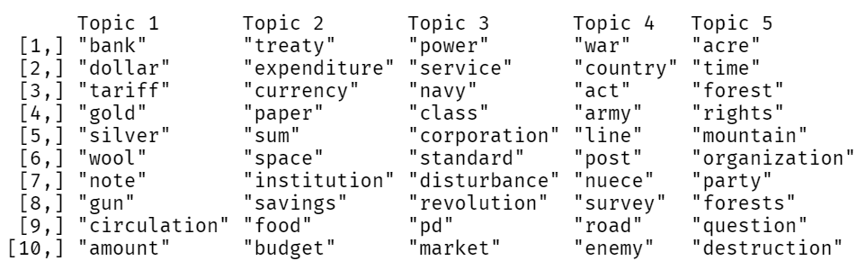
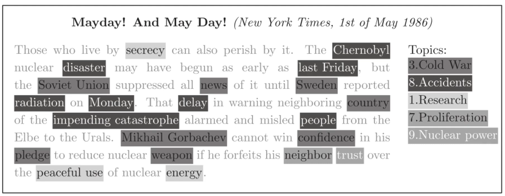
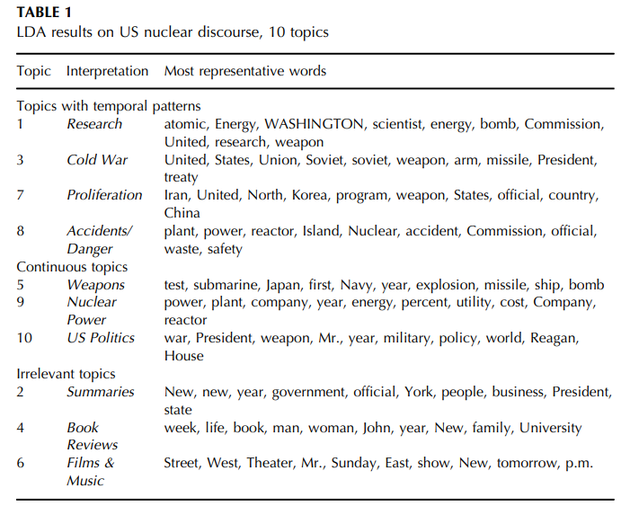
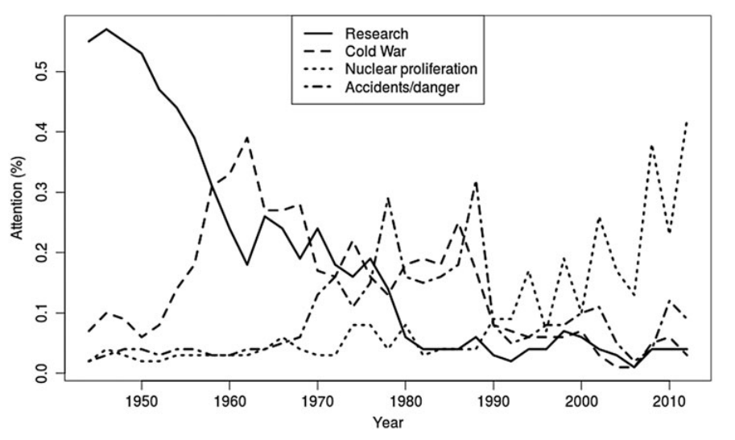
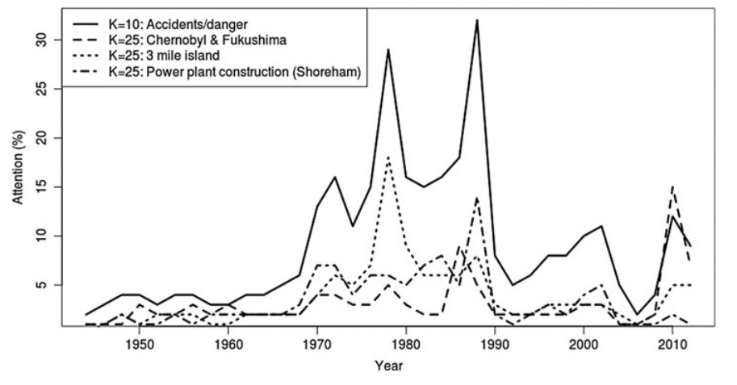
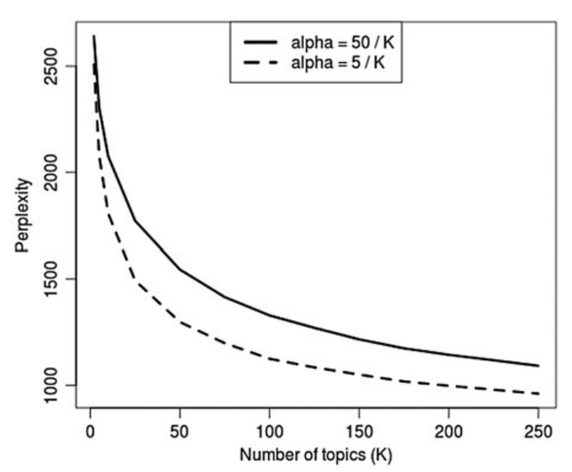
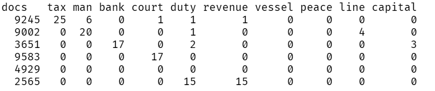
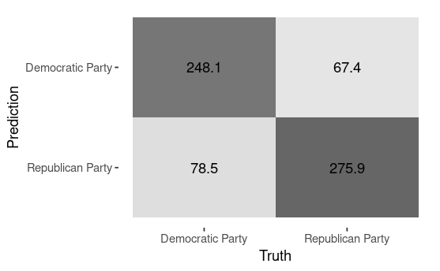

layout: true


<style>

 .tab { margin-left: 40px; }

.onehundredtwenty {
  font-size: 120%;
   }

<style>
.ninety {
  font-size: 90%;
   }

.eightyfive {
  font-size: 85%;
   }
   
.eighty {
  font-size: 80%;
   }
   
.seventyfive {
  font-size: 75%;
   }
   
.seventy {
  font-size: 70%;
   }
   
.fifty {
  font-size: 50%;
   }
   
.forty {
  font-size: 40%;
   }
</style>


```{r meta, echo=FALSE, warning=F, message=F}

library(tidymodels)
library(metathis)
meta() %>%
  meta_general(
    description = "Quantitative Text Analysis in R",
    generator = "xaringan and remark.js"
  ) %>%
  meta_name("github-repo" = "favstats/xxx") %>%
  meta_social(
    title = "Quantitative Text Analysis in R",
    url = "https://www.favstats.eu",
    og_type = "website",
    og_author = "Fabio Votta",
    twitter_card_type = "summary_large_image",
    twitter_creator = "@favstats"
  )
```


```{r setup, include=FALSE}
# dateWritten <- format(as.Date('2020-05-04'), format="%B %d %Y")
workshop_day <- format(as.Date("2022-06-29"), format="%B %d %Y")
pacman::p_load(xaringanthemer, fontawesome, tidyverse, knitr)

options(
    htmltools.dir.version = FALSE,
    knitr.table.format = "html",
    knitr.kable.NA = ""
)
knitr::opts_chunk$set(
    warning = FALSE,
    message = FALSE,
    fig.path = "figs/",
    fig.width = 7.252,
    fig.height = 4,
    comment = "#>",
    fig.retina = 3 # Better figure resolution
)


# Enables the ability to show all slides in a tile overview by pressing "o"
xaringanExtra::use_tile_view()
xaringanExtra::use_panelset()
xaringanExtra::use_clipboard()
# xaringanExtra::use_share_again()
# xaringanExtra::style_share_again(share_buttons = "all")
xaringanExtra::use_extra_styles(
  hover_code_line = TRUE,
  mute_unhighlighted_code = FALSE
)
# xaringanExtra::use_webcam()


knitr::opts_chunk$set(warning = F, message = F) # Whether to display errors
```


---
name: title-slide
class: title-slide, center, middle


<div class="my-logo-right"></div> 

<br>

# .font150[.fancy[`r rmarkdown::metadata$title`]] 

### .font120[.fancy[`r rmarkdown::metadata$subtitle`]]

*Spring Camp University of Warwick*

Instructor: Fabio Votta

[`r fa(name = "twitter", fill = "white")` @favstats](http://twitter.com/favstats)<br>
[`r fa(name = "github", fill = "white")` @favstats](http://github.com/favstats)<br>
[`r fa(name = "globe", fill = "white")` favstats.eu](https://www.favstats.eu)


29th June 2022 (Day 2)

.fifty[Link to slides: [favstats.github.io/WarwickSpringCamp_QTA/slides/day2/](https://favstats.github.io/WarwickSpringCamp_QTA/slides/day2/)]

---

### Overview Day 2 (10:00 to 16:00)

.font80[

+ Part-of-speech tagging
  + Keyword extraction
  + RAKE, Noun phrases, dependency parisng
  
15   M I N U T E S   B R E A K:   *10:45*

+ Project (45 minutes time)

1   H O U R   B R E A K:   *12:00*

+ Unsupervised Machine Learning (Topic Modelling) *13:00*
  
15   M I N U T E S   B R E A K:   *14:00*

+ Supervised Machine Learning

+ Project (45 minutes time)

*15 minutes for presentations*

]


---

class: center, middle

# Part-of-speech tagging

<center>


  
</center>

---


## Part-of-speech tagging

> Part-of-speech tagging is the process of assigning a syntactic tag to each word in a sentence. 

For example, in the sentence: 

`"The dog chased the cat."`

1. "dog" and "cat" would be assigned the tag "noun"

2. "chased" would be assigned the tag "verb." 

The most common parts of speech are nouns, verbs, adjectives, adverbs, and pronouns, but there are many more!

---


## NLP with `udpipe`


> "`udpipe` provides quick and simple annnotations giving rich output: tokenization, part-of-speech-tagging, lemmatization and dependency parsing with multi-language support. From raw text to parsed output for more than 50 languages."

```{r}
library(udpipe)
```


---

### NLP with `udpipe`

.font70[
*The* following table contains the so-called **universal part-of-speech tags** (upos). 

]

.font40[

| Universal POS tags | Meaning                   | Definition                                                                                                                                                                                                                      | Example                                                          |
|--------------------|---------------------------|---------------------------------------------------------------------------------------------------------------------------------------------------------------------------------------------------------------------------------|------------------------------------------------------------------|
| ADJ                | adjective                 | Adjectives are words that typically modify nouns and specify their properties or attributes:                                                                                                                                    | The car is **green**.                                            |
| ADP                | adposition                | In many languages, adpositions can take the form of fixed multiword expressions,                                                                                                                                                | **in** spite **of**, because **of**, thanks **to**               |
| ADV                | adverb                    | Adverbs are words that typically modify verbs for such categories as time, place, direction or manner.                                                                                                                          | He ate **slowly**.                                               |
| AUX                | auxiliary                 | An auxiliary is a function word that accompanies the lexical verb of a verb phrase and expresses<br>grammatical distinctions not carried by the lexical verb, such as person, number, tense, mood, aspect,<br>voice or evidentiality. | Tense auxiliaries: **has** (done), **is** (doing), **will** (do) |
| CCONJ              | coordinating conjunction  | A coordinating conjunction is a word that links words or larger constituents without syntactically<br>subordinating one to the other and expresses a semantic relationship between them.                                           | **and**, **or**, **but**                                         |
| DET                | determiner                | Determiners are words that modify nouns or noun phrases and express the reference of the noun phrase in context.                                                                                                                | **the**, **this**, **that**, **which**                           |
| INTJ               | interjection              | An interjection is a word that is used most often as an exclamation or part of an exclamation.                                                                                                                                  | **psst**, **ouch**                                               |
| NOUN               | noun                      | Nouns are a part of speech typically denoting a person, place, thing, animal or idea.                                                                                                                                           | The **cat** is in the **hat**.                                   |
| NUM                | numeral                   | A numeral is a word, functioning most typically as a determiner, adjective or pronoun, that expresses<br>a number and a relation to the number, such as quantity, sequence, frequency or fraction.                                 | **0**, **1**, **2**, **one**, **two**, **three**                 |
| PART               | particle                  | Particles are function words that must be associated with another word or phrase to impart meaning<br>and that do not satisfy definitions of other universal parts of speech                                                       | Possessive marker: [en] ‘s                                       |
| PRON               | pronoun                   | Pronouns are words that substitute for nouns or noun phrases, whose meaning is recoverable<br>from the linguistic or extralinguistic context.                                                                                      | personal pronouns: I, you, he, she, it, we, they                 |
| PROPN              | proper noun               | A proper noun is a noun (or nominal content word) that is the name (or part of the name)<br>of a specific individual, place, or object.                                                                                            | **London**, **NATO**, **Mary Sue**                               |
| PUNCT              | punctuation               | Punctuation marks are non-alphabetical characters and character groups used in many languages<br>to delimit linguistic units in printed text.                                                                                      | **,**, **.**, **(**, **:**                                       |
| VERB               | verb                      | A verb is a member of the syntactic class of words that typically signal events and actions                                                                                                                                     | He **runs**.                                                     |


]

---

### One function to rule them all: `udpipe()`

`udpipe()` is the main work horse of the `udpipe` package. With it you can perform

+ tokenization
+ lemmatization
+ part-of-speech tagging
+ dependency parsing

**all in one!**

>  On dependency parsing:  dependency parsing is a type of syntactic parsing that identifies the dependencies between words in a sentence. Dependency parsers typically use a set of rules to find these dependencies, and these rules can vary depending on the language being parsed.


---

#### Trump tweet example


Let's apply `udpipe()` on the "nuclear" Trump tweet from yesterday and see what it can do for us!

```{r}
## read in Trump tweets
trump_tweets <- readr::read_csv("https://raw.githubusercontent.com/favstats/WarwickSpringCamp_QTA/main/docs/slides/day1/data/trump_tweets.csv")


## nuclear tweet
trump_tweet <- trump_tweets[trump_tweets$id == 1165918301932916736,]

trump_tweet$text
```


---

#### Trump tweet example

.pull-left[

`udpipe()` expects a data.frame with two variables:

1. `doc_id`, a unique identifier for your document
2. `text`, the text you are trying to parse


```{r, eval = F}
trump_tweet_ud <- trump_tweet %>%
  mutate(doc_id = id)

pos_tags_trump <- udpipe(trump_tweet_ud, "english")

pos_tags_trump %>%
  select(token, upos, lemma) %>% kable()
```

]

.pull-right[


```{r, echo = F}
trump_tweet_ud <- trump_tweet %>%
  mutate(doc_id = id)

pos_tags_trump <- udpipe(trump_tweet_ud, "english")

pos_tags_trump %>%
  select(token, upos, lemma, dep_rel) %>% 
  slice(1:22) %>%
  kable() %>% kableExtra::kable_styling(font_size = 10) 
```


]


---

### Visualizing the nice tidy data frame that `udpipe()` puts out

.font50[
We can visualize all the output from `udpipe()` using the function (taken from [here](https://www.r-bloggers.com/2019/07/dependency-parsing-with-udpipe/#:~:text=Dependency%20parsing%20is%20an%20NLP,you%20further%20details%20about%20it.)).
]


---

### Keyword extraction

.font80[


Now we have tags for our text. Brilliant. What can we do with this? 

Similar as before, we are interested in what's going on in our text. 

Part-of-speech tagging can enable us to find more meaningful keywords that tell us something about the texts we are investigating.

`udpipe()` offers various methods for keyword extractions:


1.   Find keywords by doing **parts of speech tagging in order to identify nouns**
2. Find keywords based on **collocations and co-occurrences**
3. Find keywords based on algorithms
  * **RAKE** (rapid automatic keyword extraction)
4. Find keywords by looking for **phrases** (e.g. noun phrases)
5. Find keywords based on results of **dependency parsing** (getting the subject of the text)


]


---

#### Most frequent nouns/verbs etc.

Let's now run part-of-speech tagging to find the most common nouns and verbs that Trump uses.

```{r, eval = F}
# This takes a couple of minutes

trump_tweets_uds <- trump_tweets %>%
  filter(date_year %in% 2016:2021) %>%
  mutate(doc_id = id)  %>%
  mutate(doc_id = as.character(doc_id))

pos_tags_trump_all <- udpipe(trump_tweets_uds, "english")  %>%
  left_join(trump_tweet_ud)
```

```{r, echo = F}
pos_tags_trump_all <- readRDS(url("https://raw.githubusercontent.com/favstats/WarwickSpringCamp_QTA/main/docs/slides/day2/data/pos_tags_trump_all.rds"))

```


---

#### Most frequent nouns


```{r}
pos_tags_trump_all %>%
  filter(upos == "NOUN") %>%
  count(token, sort = T) %>%
  head(10)  %>% 
  mutate(word_n = paste0(token, ": ", n)) %>% 
  pull(word_n)
```


---

#### Most frequent verbs


```{r}
pos_tags_trump_all %>%
  filter(upos == "VERB") %>%
  count(token, sort = T) %>%
  head(10)  %>% 
  mutate(word_n = paste0(token, ": ", n)) %>% 
  pull(word_n)
```

---

#### RAKE (rapid automatic keyword extraction)

> RAKE is a basic algorithm which tries to identify keywords in text. Keywords are defined as a sequence of words following one another. 

Frequency of occurence plays a role as well, as well as frequency of co-occurences with other words. Word combinatiosn with higher values are considered to be more frequent and unique.

If you want to know more about RAKE [see here](https://www.analyticsvidhya.com/blog/2021/10/rapid-keyword-extraction-rake-algorithm-in-natural-language-processing/).


---

#### RAKE (rapid automatic keyword extraction)

.panelset[
.panel[.panel-name[Extract RAKE]


```{r}
## Using RAKE
rake_keys <- keywords_rake(
  x = pos_tags_trump_all %>% mutate(lemma = stringr::str_to_lower(lemma)), 
  term = "lemma", group = "doc_id", 
  relevant = pos_tags_trump_all$upos %in% c("NOUN", "VERB", "ADJ")
  )
                       
```

]


.panel[.panel-name[Visualization code]

```{r, eval = F}

library(ggplot2)


#stats
rake_keys %>% 
  filter(freq > 5) %>%
  arrange(-rake) %>%
  mutate(keyword = forcats::fct_reorder(keyword, rake)) %>%
  slice(1:20) %>%
  ggplot(aes(keyword, rake)) +
  geom_col() +
  coord_flip() +
  theme_minimal()
```

]


.panel[.panel-name[Visualization]

```{r, echo = F}
#stats
rake_keys %>% 
  filter(freq > 5) %>%
  arrange(-rake) %>%
  mutate(keyword = forcats::fct_reorder(keyword, rake)) %>%
  slice(1:20) %>%
  ggplot(aes(keyword, rake)) +
  geom_col() +
  coord_flip() 
```

]

]

---

#### (Simple) Noun Phrases


Next option is to extract (simple) noun phrases. What are they?

Noun phrases are groups of words that function like nouns.

Some examples:

**All the children** were eating.

She bought herself **a beautiful dark dress**.

Dad baked **a tasty chocolate cake**.


---

#### (Simple) Noun Phrases

.font80[

How does this work? Parts of Speech tags are recoded to one of the following one-letters: 

> A: adjective, C: coordinating conjuction, D: determiner, M: modifier of verb, N: noun or proper noun, P: pre/postposition. 

Next you can define a regular expression to indicate a sequence of parts of speech tags which you want to extract from the text.

As regex we can express a (simple) noun phrase as this:

> `(A|N)*N(P+D*(A|N)*N)*`

For more info on noun phrases [see here](https://universaldependencies.org/workgroups/newdoc/simple_noun_phrases.html).

]


---


#### (Simple) Noun Phrases

```{r}
## Simple noun phrases (a adjective+noun, pre/postposition, optional determiner and another adjective+noun)
pos_tags_trump_all$phrase_tag <- as_phrasemachine(pos_tags_trump_all$upos, type = "upos")

keyw_nounphrases <- keywords_phrases(pos_tags_trump_all$phrase_tag, term = pos_tags_trump_all$token, 
                                     pattern = "(A|N)*N(P+D*(A|N)*N)*", is_regex = TRUE, 
                                     detailed = T)


```


---


#### Most common (simple) noun phrases

```{r}
keyw_nounphrases %>%
  filter(ngram >= 3) %>%
  count(keyword, sort = T) %>%
  head(20)  %>% 
  mutate(keyword_n = paste0(keyword, ": ", n)) %>% 
  pull(keyword_n)
```

---

#### Dependency Parsing

For this exercise we are going to take the words which have as dependency relation "*nsubj*" indicating the nominal subject and we are adding to that the adjective which is changing the nominal subject.


```{r}
stats <- merge(pos_tags_trump_all, pos_tags_trump_all, 
           by.x = c("doc_id", "paragraph_id", "sentence_id", "head_token_id"),
           by.y = c("doc_id", "paragraph_id", "sentence_id", "token_id"),
           all.x = TRUE, all.y = FALSE, 
           suffixes = c("", "_parent"), sort = FALSE) 

stats <- subset(stats, dep_rel %in% c("nsubj") & upos %in% c("NOUN", "PROPN") & upos_parent %in% c("ADJ"))

stats$term <- paste(stats$lemma_parent, stats$lemma, sep = " ")


```

---


#### Dependency Parsing

```{r}
stats %>%
  count(term, sort = T) %>%
  head(20)   %>% 
  mutate(term_n = paste0(term, ": ", n)) %>% 
  pull(term_n)
```

---

class: center, middle, inverse

# Machine Learning

<center>


  
</center>

---

## Machine Learning

> Machine learning, broadly defined, are a range computational methods that can "learn" by discovering patterns in data.

There are two (for us relevant) methods how machines can learn:

1. *Unsupervised* machine learning (clustering)
2. *Supervised* machine learning (classification)


---

## Machine Learning

> Machine learning, broadly defined, are a range computational methods that can "learn" by discovering patterns in data.

**Unsupervised machine learning (clustering)**

In *unsupervised learning* we let an algorithm figure out quantities of interest, solely by supplying it with the data.

Typically, this happens by identifiyng so-called *clusters* that are more similar to each other in some way, compared to other clusters.


---

## Machine Learning

> Machine learning, broadly defined, are a range computational methods that can "learn" by discovering patterns in data.


**Supervised machine learning (classification)**

In *supervised learning* we provide a machine learning model with some data (*training data*) from which it can learn patterns.

For example, we may have some annotated tweets that tell us whether they are positive or negative. We can leverage that data to let a machine learning model learn the patterns of text that are positive vs. negative.

---

## Machine Learning

Most important thing to remember:

+ *Unsupervised* machine learning 

<p class="tab">&#8594; learns patterns by itself</p>


+ *Supervised* machine learning (classification)


<p class="tab">&#8594; learns patterns based on provided (human) annotations</p>


---

class: center, middle, inverse

# Topic Models

an .fancy[unsupervised machine learning] method

---


## Topic Models

.font80[
> Topic models can be used to identify "topics" in (large corpora of) text. 


You may have noticed that I put "topics" in quotation marks. That is because the output of a topic model is not what one would *intuitively* understand as topic.

Here is an example output:
]




---

## Topic Models - Example

> Jacobi, C., van Atteveldt, W., & Welbers, K. (2015). Quantitative analysis of large amounts of journalistic texts using topic modelling. Digital Journalism, 4(1), 89–106. doi:10.1080/21670811.2015.1093271


*a case study of the New York Times coverage of nuclear technology from 1945*

---


## Jacobi et al.



---

## Jacobi et al.





---

## Jacobi et al.





---

## Jacobi et al.



---

## Jacobi et al.





---

## Topic Models

We are going to take a look at Latent Dirichlet Allocation (LDA) in particular (a common implementation of topic modelling)

An LDA has two model assumptions:

+ every document can be represented as a distribution of topics - $\theta$ (also sometimes called $\gamma$)

This means: every document consists of a range of topics

+ every topic can be represented as distribution of terms - $\beta$


This means: every topic consists of a range of terms

Another important parameter is $\alpha$, which regulates how topics cluster per document

---


## The conference table

What is a *latent dirichlet allocation*?

Often explained with the "conference table process":

1. You walk into a room for a conference dinner 

2. You don't want to sit alone

3. Everyone does the same as they enter

+ Empty tables stay empty, full tables get more people proportionally until equilibrium is reached

https://topicmodels.west.uni-koblenz.de/ckling/tmt/restaurant.html?parameters=1,1,1,1

---


## Dirichlet at an academic conference 

+ The conference dinner converges to a multinomial distribution

  + e.g. the topics per document, of words per topic

+ The initial number of people at the tables is the *alpha parameter*

+ Intuitive effect of lower alpha

  + initial choice of "conference attendees" have larger effect
  + likelier that a single table will get all participants
  
  
+ Lower alpha = fewer topics per document

  + but means topics have to include more words / have more overlap, as each word needs to be assigned

---


## You have to choose (the K)

As unsupervised methods, topic models do not know how many topics it should estimate

This is a parameter called *K*

Choosing K (how many topics you want to be estimated) is almost a science in itself

---


## Validating topic models

+ What does it mean "to measure a topic"

+ Three strategies

  + Face validity: inspect top terms, top documents, edge cases
  + Concurrent validity: does the model reproduce expert or gold-standard coding?
  + Construct validity: are topics *cohesive* and *distinctive*?
  
cohesive: coherent terms within topics

distinctive: distinctive from other topics

See: Chang et al. (2009): [Reading Tea Leaves: How Humans Interpret Topic Models](https://proceedings.neurips.cc/paper/2009/file/f92586a25bb3145facd64ab20fd554ff-Paper.pdf)

---

## Document-term matrix

Most topic models take data as a so-called "*document-term-matrix* (dtm). A dtm is a matrix (with rows and columns) that counts the number of times terms occur in specific documents.

This is what it looks like:




---

.leftcol75[

## `debates` dataset

.font80[
`debates` provides easy access to debate transcripts from Presidential, Vice Presidential, and primary candidate debates. The current version includes Presidential and Vice-Presidential debate transcripts starting in 1960, and for most debates from the 2012, 2016, and 2020 primary elections.
]

]

.rightcol25[


```{r, echo = F, out.width=100, out.height=120, fig.align='right'}
knitr::include_graphics("https://github.com/jamesmartherus/debates/raw/master/man/figures/logo.png")
```

]

<br>

<br>

<br>

<br>

<br>


.font70[
We will estimate topic models on the `debates` dateset. 

We could estimate our topic models using all the words within the documents but:

1. Many words will not be good indicators of a topic
2. It will take a long time

So for efficiency, we will **only keep lemmatized nouns** (as identified by POS tagging).

A similar approach has been taken by Jacobi et al., 2016, and Lind et al., 2021.

*continue in script topic_modelling.Rmd*

]


---


class: center, middle, inverse

# Supervised Machine Learning


---

## Supervised Machine Learning

> Supervised machine learning is a type of machine learning algorithm that uses a labelled dataset to train a model to make predictions.

In comparison to unsupervised machine learning, supervised learning requires labels often provided by the researchers.

The labelled dataset is a collection of data that has been labelled with the desired outcome. 

The model is then able to use the labelled dataset to learn how to map the input data to the correct output. 


---


## Supervised Machine Learning

Similarities to typical statistical modelling

+ You can also use linear/logistic regression for machine learning

However: we are more interested in prediction, not explaining

Models may have 1000s of independent variables

We are not interested in the effects, but rather the outcome

---


## Supervised text classification

Supervised machine learning is a powerful tool for text classification. It can be used to automatically categorize texts into different classes. 

For example, it can be used to classify emails into spam and non-spam, or articles into different topics. 

Another typical use-case for supervised ML is sentiment analysis.


---


## Main drivers of model performance

1. Task difficulty

2. Amount of training data

3. Choice of features (n-grams, lemmata, etc.)

4. Tuning of hyperparameters

---


## Train and Test data


Training data is the data that we use to train our models. This data is used to fit the model and is used to optimize its parameters. 

Test data is the data that we use to evaluate our trained model. This data is used to see how well the model performs on unseen data. 

It's important to have both training and test data because we want to make sure that our model is generalizable. 

That is, we want to make sure that our model can perform well on data that it hasn't seen before. 


---

### Prevent overfitting


.font70[
+ Sufficiently complex model can "predict" all training data perfectly

+ However: our model would perform poorly on new, unseen data. This is called **overfitting**. 

+ Process:

1. Split data into train + test

2. Train model on training data

3. Test model on unseen test data
]


---

### What is cross-validation in supervised machine learning?

> Cross-validation is a technique used to assess the accuracy of a model and prevent overfitting by repeatedly resampling the dataset and re-fitting the model.

.font80[
Why is cross-validation necessary?

Cross-validation is necessary because it provides a more accurate estimate of the model's performance than using the training set alone. It also helps to prevent overfitting.

What are the benefits of cross-validation?

- improved accuracy
- prevention of overfitting

What are the drawbacks of cross-validation?

- extra computational time
]


---

## Choosing model and hyperparameters

.font70[

Many different model types exist

+ Linear/logistic Regression, naive bayes, neural networks, etc.

They all come with different hyperparemeters

+ Learning rate, regularization, neural network structure

*What are hyperparameters?*

Hyperparameters are parameters, *settings*, that define the overall structure and behaviour of a machine learning model. 

They can significantly impact the performance of a machine learning model.

]

---


## Hyperparameters in Supervised Machine Learning


.font80[

*What are the benefits of tuning hyperparameters?*

Tuning hyperparameters can improve the performance of a machine learning model and make it more robust.

*What are the downsides of tuning hyperparameters?*

Tuning hyperparameters can be time-consuming and may not always lead to improved performance. 

*How can hyperparameters be tuned?*

Hyperparameters can be tuned using a variety of methods, including grid search, random search, and manual search.


]

---

## Model performance


---

## Model performance

.pull-left[



]

.pull-right[
.font80[

Sensitivity = $\frac{TP}{TP+FN}$

= 248.1/248.1+67.4 = 0.79

Sensitivity = $\frac{TN}{TN+FP}$

= 275.9/275.9+78.5 = 0.78

Accuracy = $\frac{TP+NP}{TP+FN+TN+FP}$

= (275.9+248.1)/(248.1+67.4+275.9+78.5) = 0.78
]
]


