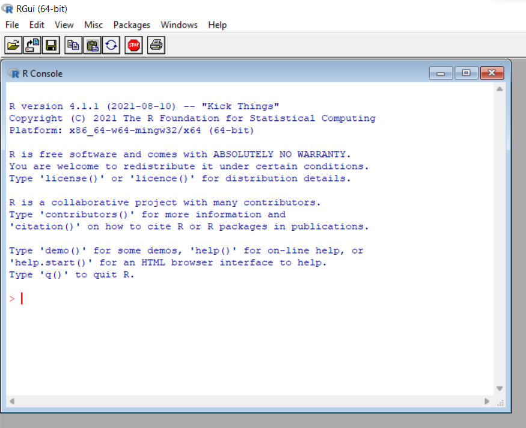
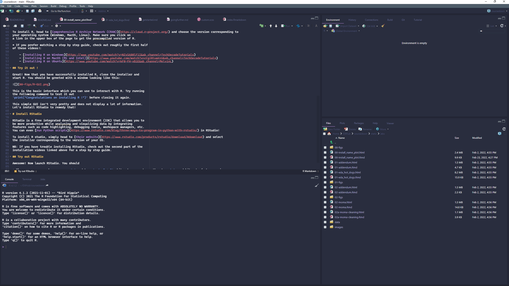

```{r setup, include = FALSE, cache = FALSE}
knitr::opts_chunk$set(error = TRUE,
                      comment = NA,
                      warnings = FALSE,
                      errors = FALSE,
                      messages = FALSE,
                      tidy = FALSE)
```

```{r load-packages, include = FALSE}
library(tidyverse)
library(gapminder)
```

# Installing R and RStudio

This guide will get you ready to work with R and RStudio. It will also teach
you the basics of version control with GitHub within you data analysis workflow
to facilitate collaboration and ensure the safety of your data and scripts.

The installation process of these different tools will be done in the following
few steps you should do in order. 

# Installing R

R is a free software environment and programming language for statistical computing and data visualization maintained by the R foundation.

To install R, head to [Comprehensive R Archive Network (CRAN)](https://cloud.r-project.org/) and choose the version corresponding to
your operating system (Windows, MacOS, Linux). Make sure you click on
a link in the upper box of the page to get the precompiled version of R.

* If you prefer watching a step by step guide, check out roughly the first half
of these videos!:

    - [Installing R on Windows](https://www.youtube.com/watch?v=NZxSA80lF1I&ab_channel=TechDecodeTutorials)
    - [Installing R on MacOS (M1 and Intel)](https://www.youtube.com/watch?v=cCgiR1uwXzU&ab_channel=TechDecodeTutorials)
    - [Installing R on Ubuntu](https://www.youtube.com/watch?v=kF0-FH-xBiE&ab_channel=MelvinL)

## Try it out !

Great! Now that you have successfully installed R, close the installer and
start R. You should be greeted with a window looking like this:



This is the basic interface which you can use to interact with R. Try running
the following command to test it out
`print("Congratulations on installing R!")` before closing it again.

This simple GUI isn't very pretty and does not display a lot of information.
Let's install RStudio to remedy that!

# Install RStudio 

RStudio is a free integrated development environment (IDE) that allows you to
be more productive while analysing and visualizing data by integrating
features such as code highlighting, debugging tools, workspace managers, etc.
You can even [run Python scripts](https://www.rstudio.com/blog/three-ways-to-program-in-python-with-rstudio/) in RStudio!

To install R studio, simply head to [their website](https://www.rstudio.com/products/rstudio/download/#download) and select
the installer corresponding to the version of your OS.

NB: If you have trouble installing RStudio, check out the second part of the
installation videos linked above for a step by step guide.

## Try out RStudio

Awesome! Now launch RStudio. You should see a window that is similar to the one
I have while I am writing this article (with a different theme).



If this is the case, try running a few simple lines of code to test whether
R and RStudio have been correctly installed. Let us type the following command
in the console (i.e. the bottom left pane where you see `>`).
Simply type `print("Congratulations on installing RStudio!")` and check that the
resulting message you get is `[1] "Congratulations on installing RStudio!"`.
Getting this message means that you have successfully installed both R and
RStudio.

Before we proceed, take the time to look at the RStudio IDE cheatsheet you will
find [here](https://raw.githubusercontent.com/rstudio/cheatsheets/main/rstudio-ide.pdf).
This will get you acquainted with the different panes and buttons on the screen.

# Getting readyfor your first data vizualization project!

Now that you have installed base R and the RStudio IDE you're almost ready for your
first data visualization project! This little tutorial will also outline
how to install new packages to extend R's functionalities and play around
with objects such as graphs and dataframes!

## Learning how to install R packages:

A helpful metaphor that allowed me to grasp the difference between base R and
packages is the workshop metaphor. Base R, the program we just installed, is our
workshop and already contains a number of basic tools (e.g. functions) such as
the `print()` function we used above. Now, think of packages as toolboxes of
additional functions/tools that you can add to your workshop to speed up your
data analysis workflow or to conduct more specialized tasks for instance e.g. a
carpenter won't use the same tools as an electrician.

Now that you know what packages are, you might wonder where one can download
them. The good news is that the vast majority of them is one command away and
is free and open-source (meaning that you can check their source code online!).
There are essentially two places you will find them:

- CRAN --> Installed via the `install.packages("package_name")` command
- GitHub --> Installed via `devtools::install_github("username/repositoryname")`
  command after having installed the `{devtools}` package from CRAN.

```{r devtools, eval = FALSE}
install.packages("devtools")  # Install the devtools package
library(devtools)             # Load the package into the R session
install_github("username/package_name") # Install some other package from Github
```

Now that we have seen how to install packages from the two main sources, let's
try it out and install a couple of packages ourselves!

```{r installpkgs, eval = FALSE}
# Run the following commands in your R-Studio console before proceeding
install.packages("devtools")  # Install the devtools package
install.packages("tidyverse") # A set of SUPER useful packages
install.packages("gapminder") # Some data for our data visualization exercise

# NB: A neat way of doing this is to install them all at once by putting them
# their names inside a vector with c()!
install.packages(c("devtools", "tidyverse", "gapminder"))
```

## Learning how to use R packages:

Awesome! You've just installed a few packages and considerably expanded your
data analysis toolbox. Now, the unfortunate thing is that you cannot use these
tools right away without telling R in which toolbox they are. In other words,
you will need to either "import" them once per R session by running the
`library(package_name)` command or reference them before each function
by writing `package_name::myfunction()`.

```{r use_packages, eval = FALSE}
# tibble() is a function from the {dplyr} package we just installed with the
# {tidyverse}. Hence, simply calling tibble() won't work:
tibble(mtcars)
# We can access it either by loading the {dplyr} package...
library(dplyr)
tibble(mtcars)
# ... or by referencing it explicitly:
dplyr::tibble(mtcars)
```
You might wonder why the two ways exist since the first one seems way more
convenient. One example when I found the second option safer and more convenient
was when I was dealing with network analysis methods which came in different
packages. Unfortunately, these packages contained identically or very similarly
named functions which complicated my network analysis workflow. This becomes
especially an issue since functions of the most recently loaded package take
precedence over the latter. Hence, I've taken the habit of writing out the
explicit name of the package from which the function comes. Plus, it will jog
your memory and make you remember in which package you'll find which function!

```{r load_packages, eval = FALSE}
# Loading the previously installed packages
library(devtools)
library(tidyverse)
library(gapminder)
```

## Package documentation and citation

Every (user-accessible) function in a package contains a documentation file
that you can access by typing `?function_name` after having loaded the package.
This documentation details the inner workings of the function e.g. what type
of inputs it must be provided and what is output is. This is usually the first
place to look for help when encountering an error while using a function.

Finally, as with every academic paper or book, it is important to cite the tools
you used within your data analysis workflow. R made this simple by providing
users with the simple `citation("name_of_package")` command.


```{r ggplot2, eval = F}
library(ggplot2)  # Load the{ggplot2} package
help("ggplot2")   # Ask for package help page
?tibble         # Ask for function help page
```

```{r citing_ggplot2}
citation("dplyr") # Ask for citation info
```


<p class="alert alert-warning"> __Careful:__ R is **case-sensitive**, so `?ggplot2` works but `?Ggplot2` will not. Likewise, a variable called `A` is different from anoter called `a`.</p>


## Create your first plot

Now that you have all the tools at your disposal, let's create our first
data visualization project! Feel free to open up a new R script in RStudio
by clicking on `File --> New File --> R Script` or holding down `CTRL+SHIFT+N`
on your keyboard and copy and paste the following code into your file.

The first thing we'll do is to load all the necessary packages for our
little project:

```{r loadpackages, eval = F}
library(gapminder) # A package with the data we'll analyse
library(tidyverse) # A set of packages for data analysis and visualization
```

Datasets come in different formats and from various sources. We'll see in
a further lab session how to import the most common types of datasets. For now 
we will use the datasets contained in the 
[`{gapminder}`](https://github.com/jennybc/gapminder) package. This data is
essentially an excerpt of the famous [gapminder](https://www.gapminder.org/)
database. Let's have a look at what we're working with!

```{r FirstLook}
# Let's look at the original dataset from the {gapminder} package
glimpse(gapminder) # Displays a description of the data (dplyr)
head(gapminder) # Displays the first observations (base R)
tail(gapminder) # Displays the last observations (base R)
names(gapminder) # Displays column names (base R)
summary(gapminder) # Displays a summary of the data
```

It looks like a panel dataset with 5-year interval observations of the life 
expectancy, the population and the GDP per capita for each country over the 
period 1952-2007. Let's create a new dataframe by selecting only the data for
a few European countries to plot the evolution of income per capita over time.


```{r extracteudata}
# Extract information with dplyr:
eu_data <- gapminder %>%
  filter(country == "Switzerland" |
           country == "France" |
           country == "Germany")

# The equivalent, non-pipe code looks like this:
# eu_data <- gapminder
# eu_data <- filter(eu_data,
#                   country == "Switzerland" |
#                     country == "France" |
#                     country == "Germany")
```

The first line assigns the `gapminder` dataset to the `eu_data` variable. The
[pipe operator `%>%`](https://r4ds.had.co.nz/pipes.html) allows us to combine
multiple operations on a single dataset. For instance, here we filter our
observations with `dplyr::filter()` after creating the new `eu_data` dataset.

How does this subsetted dataframe look now ?

```{r}
eu_data
summary(eu_data)
```

Looks like we've successfully extracted the data for Switzerland, France and
Germany! Let's move on and plot the life expectancy of these three countries
over the past half century.

```{r createplot}
# Create your first plot
plot <- ggplot(eu_data, aes(x = year,           # Set the x axis
                            y = lifeExp,        # Set the y axis
                            group = country,    # Set the countries to plot
                            color = country)) + # Set different colors
  geom_line() # Add a line geom to draw the actual lines
```

Hold on, where is my plot? Didn't I just create it? 

Absolutely, you just created your `plot` and saved it in your environment
that you can see on the top right corner of your screen along side the `eu_data`
dataframe. You can now visualize it by typing `plot` in your console!

```{r}
plot 
```

Et voilà! You just created your first plot in R!

# Now it's your turn!

Choose three other countries in the dataset and try to recreate the plot above!
Don't forget to change the names of the objects your create e.g. `eu_data` to
`yourcountries_data` and `plot` to `your_plot`. Feel free to add titles, labels,
or captions. 

```{r class.source = 'fold-hide', eval = TRUE}
# Making the first plot fancy!
fancyplot <- ggplot(eu_data, aes(x = year,      # Set the x axis
                            y = lifeExp,        # Set the y axis
                            group = country,    # Set the countries to plot
                            color = country)) + # Set different colors
  geom_line() + # Add a line geom to draw the actual lines
  labs(title = "Evolution of the Life Expectancy",
       subtitle = paste(unique(eu_data$country), collapse = ", "),
       caption = "Data: {gapminder}",
       x = "Year",
       y = "Life expectancy",
       color = "Country") + # Changing the labels of the various graph elements
  theme_minimal()           # Add a more minimalist theme
# Displaying the fancy plot
fancyplot
```

## Save your creation

The best way to save the plot you just created is to use `ggplot2::ggsave()`.
This function makes it easy to specify the various export options of plots
and provides opinionated but sensible defaults.

```{r eval = FALSE}
# Take a look at the documentation of the ggsave function
?ggsave
```

```{r eval = FALSE}
# Specify the name of the file and the plot object you'd like to save
ggsave("bernhards_plot.pdf", fancyplot)
```

Congrats! You've made it to the end of this first tutorial and have successfully
installed R and R-Studio! In the next tutorial, we will look at version control
software and learn how to install Git, Fork (a GUI for Git) and create an
account on GitHub. In the meantime, feel free to experiment further with the
`{gapminder}` data to create pretty visualizations!

# Other nice `{gapminder}` visualizations


- Check out [`{gapminder}`'s repository](https://github.com/jennybc/gapminder)
on GitHub! They have a few pretty data visualization examples on their README
page you could try to reproduce!

- If you want to explore the data visualization capabilities of R and ggplot,
check out the [*tidytuesday*](https://github.com/rfordatascience/tidytuesday) 
challenge and the associated
[shiny app](https://shiny.rstudio.com/gallery/tidy-tuesday.html)
showcasing this week's charts.


# Further resources

- [Hadley Wickham's R for Data Analysis book](https://r4ds.had.co.nz)

- [Grant McDermott's course](https://github.com/uo-ec607/lectures)

- [R Studio Cheatsheets](https://www.rstudio.com/resources/cheatsheets/)

- [R-Weekly](https://rweekly.org)

